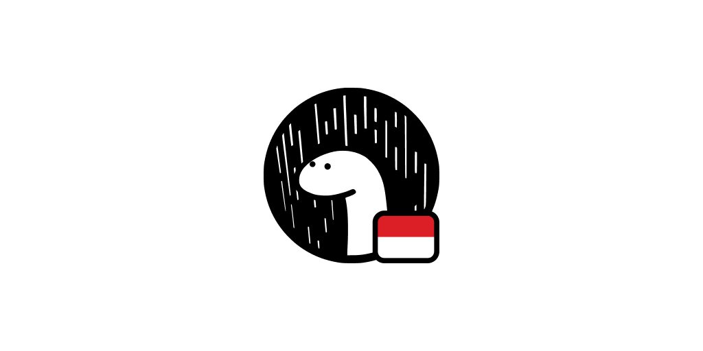
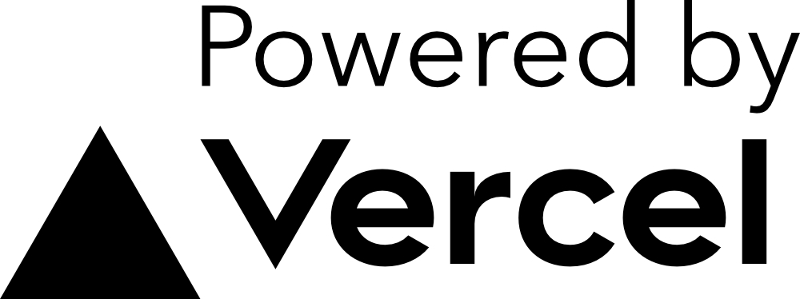

# `denoland-id/og-image`

Serverless service that generates dynamic Open Graph images that you can embed in your `meta` tags.

For each keystroke, headless chromium is used to render an HTML page and take a screenshot of the result which gets cached.

See the image embedded in the tweet for a real use case.

---

## Original Authors

- Steven ([@styfle](https://twitter.com/styfle)) - [Vercel](https://vercel.com)
- Evil Rabbit ([@evilrabbit](https://twitter.com/evilrabbit_)) - [Vercel](https://vercel.com)

---

  

